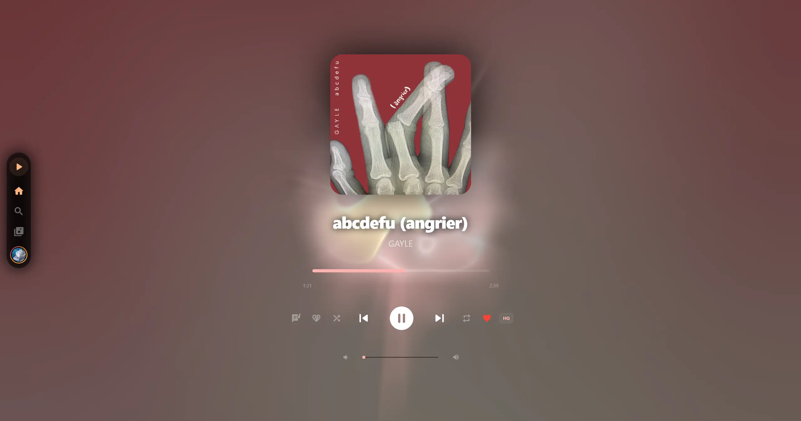
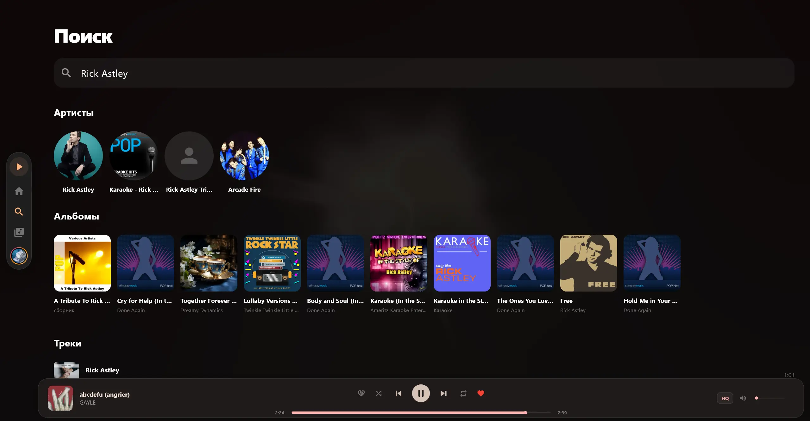

# YAYMA

Альтернативный клиент Яндекс Музыки. В будущем предоставляющий дополнительные функции. Проект находится в стадии активной разработки, может содержать баги, но пригоден для ежедневного использования. Проект написан с помощью ИИ

<table>
  <tr>
    <td align="center"> </td>
    <td align="center"> </td>
    <td align="center"> </td>
  </tr>
</table>

## Предупреждение

**YAYMA** проект созданный в целях обучения. Он использует неофициальное, не задокументированное API не предназначенное для публичного использования. Использовать на свой страх и риск.

## Возможности

- **Легковестный**
- **Не Electron :)**
- **Управление плеером в предпросмотре окна**
- **Загрузка треков**

## Благодарности❤️

- [Vyfor](https://github.com/vyfor) - за исходный tui [клиент](https://github.com/yamusic/yamusic) и [библиотеку](https://github.com/vyfor/yandex-music-rs) для работы с API
